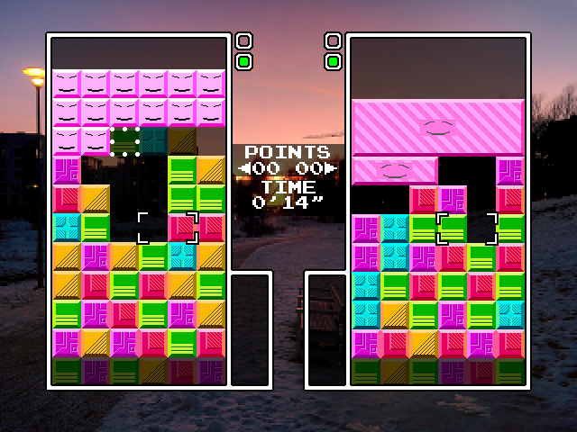

# panel-pop
A Panel de Pon / Tetris Attack / Puzzle League clone made with C++ and SDL

#### [Download latest release](https://github.com/a544jh/panel-pop/releases/latest)

[Gameplay video](http://www.youtube.com/watch?v=z_DVUP2aS9Y)

## Features:
* Original-like mechanincs modeled after SNES version
* Additional visual gameplay tweaks
* Single player endless mode
* Simple AI
* Two-player VS game with garbage blocks

## Controls

Default gameplay and menu keys:
* Arrow keys - move cursor
* `X` - accept/swap blocks
* `Z` - cancel/raise stack
* `Esc` - pause/start

Misc:
* `Ctrl`+`F` - toggle fps diplay
* `Alt`+`Return` - toggle fullscreen

### How to configure gamepads

Plug in gamepads before launching the game.
Controls can be configured individually for P1/P2 in the options menu.
The default keyboard controls will always work in the menus.

## How to build
#### Dependencies
* cmake
* SDL2
* SDL2_image
* SDL2_ttf
* SDL2_mixer
* boost

#### Linux
1. `cmake`
2. `make`

#### MacOS
1. `cmake`
2. `make`

#### Windows (MinGW)

Install https://nuwen.net/mingw.htm and then overwrite/copy ALL files from each
SDL dependency's 64-bit MinGW development distribution's `lib` and `include`
folders into the MinGW installation's respective folders.

1. `cmake -G "MinGW Makefiles" -DCMAKE_SH="CMAKE_SH-NOTFOUND"`
2. `make`
